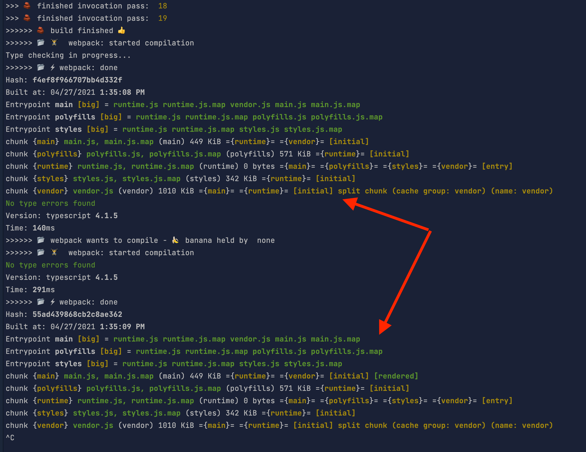

# Main file

```shell
apps/shell/plugin/incremental-dev-server-plugin.ts
```

# To run

```shell
yarn shell-serve
```

# Debug Options

By default, the `incremental-dev-server-plugin.ts` has these options:

```typescript
const debugOptions = {
  debugLogging: true,
  debugWebpackThrottlingMs: 0,
  debugBuildableLibsMultiPasses: 20,
};
```

### debugLogging

Logs the different stages of the compilation process

### debugWebpackThrottlingMs

Slows down webpack compilation by X milliseconds. Allows testing scenarios such as: what happens if a lib is changed while webpack is compiling.

### debugBuildableLibsMultiPasses

Because this workspace only contains 2 libs, building them is really fast. So testing what happens if you change files while libs are being built is difficult.

This options re-runs the build process multiple times, allowing you to emulate slower buildable lib processes.

# Remaining Issues

After each buildable lib pass is finished, and webpack "regains control", it currently compiles twice:



I think this happens due to the sequence of events:

1. User changes source of buildable lib
2. Buildable lib process starts building and makes some initial changes to `dist/`
3. Webpack watcher immediately notices this, but because it needs to wait on the build process to finish it goes to sleep
4. When the build process is finished 
5. Webpack wakes up and finishes its compilation of **those initial changes made in step 2**
6. The webpack watcher then sees that between those initial changes made in **Step 2** and the final changes made in **Step 4** there are differences,
so it re-compiles again
   
We would need a way to effectively abandon the compilation pass in **Step 5**, and just let the final pass take over.

### Other items

1. it only watches "libs" now - should we watch everything? (it won't work with a custom workspace layout)
2. needs to accept more options - at least the options for the current @nrwl/web:dev-server (like another custom webpack config)
3. angular dev-server equivalent?
4. Libs are hardcoded now. We need to look at the project this executor is applied on (provided the `--with-deps-skip-self` option exists)
